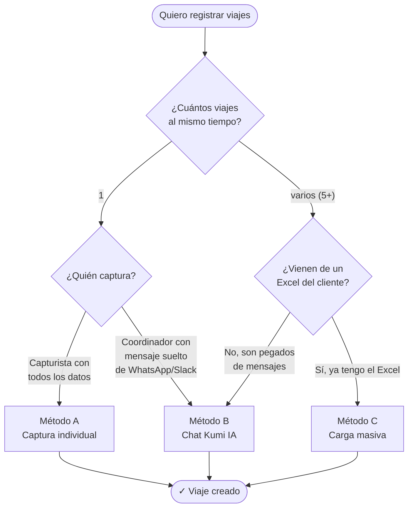
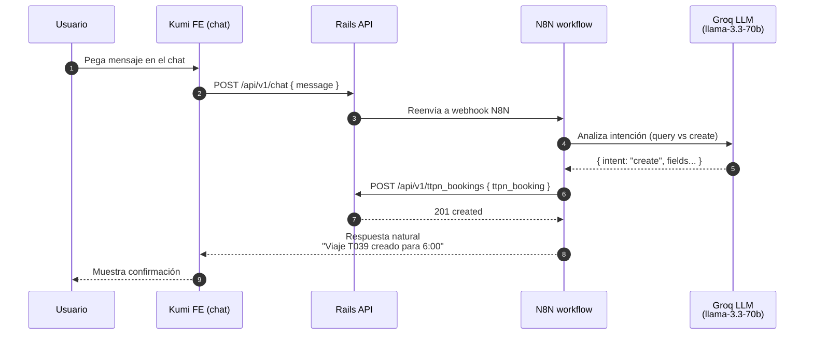
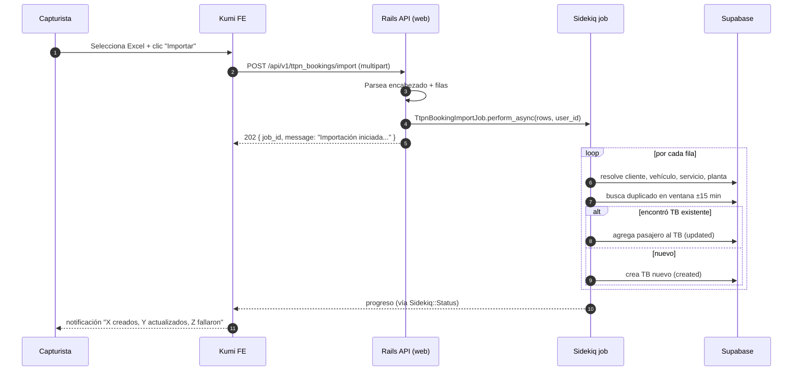

# Manual de Captura de Viajes (TtpnBookings)

Kumi by TTPN · Versión 1 · Junio 2026

Cubre **todas las formas** que tiene un usuario de Kumi para registrar un
viaje en el sistema, qué datos se necesitan, cuándo conviene usar cada
método y los formatos de carga.

---

## Índice

1. [Conceptos rápidos antes de empezar](#1-conceptos-rápidos)
2. [Cuál método usar](#2-cuál-método-usar)
3. [Método A — Captura individual desde la pantalla](#3-método-a--captura-individual)
4. [Método B — Captura por IA (chat de Kumi)](#4-método-b--captura-por-ia-chatbot)
5. [Método C — Carga masiva por Excel](#5-método-c--carga-masiva-por-excel)
   - 5.1 [Formato Excel — Mínimo (TB sin pasajero)](#51-formato-mínimo)
   - 5.2 [Formato Excel — Mínimo + Pasajero](#52-formato-mínimo--pasajero)
   - 5.3 [Formato Excel — Full](#53-formato-full)
   - 5.4 [Reglas de duplicado y ventana ±15 min](#54-reglas-de-duplicado)
6. [Catálogos previos requeridos](#6-catálogos-previos-requeridos)
7. [Solución de problemas comunes](#7-solución-de-problemas-comunes)

---

## 1. Conceptos rápidos

Un **TB (TtpnBooking)** es un viaje agendado o capturado. Cada TB pertenece
a:

| Concepto | Qué representa |
| --- | --- |
| **Cliente** | Empresa para la que se hace el viaje (ej. ZODIAC, OMA). |
| **Planta / sucursal** | Sucursal/ubicación específica del cliente (ej. B2). |
| **Vehículo** | Unidad asignada al viaje (clave en mayúsculas, ej. T039, U03). |
| **Tipo de servicio** | Categoría general (Salida, Entrada, Tiempo Extra). |
| **Servicio TTPN** | Variante específica (RTL, RTA, TEL…) — define costo, destino, contrato. |
| **Pasajeros** | Personas que viajan. Pueden ser empleados conocidos o anónimos. |

> 💡 Un mismo viaje puede tener varios pasajeros. El sistema **detecta
> duplicados** y agrega el pasajero al TB existente en lugar de crear un
> nuevo viaje. Ver [§5.4](#54-reglas-de-duplicado).

---

## 2. Cuál método usar



**Regla de oro**: si el dato ya está estructurado en columnas → Excel. Si
viene como texto natural en un mensaje → Chat IA. Si vas a capturar de a uno
con todos los datos a la vista → form individual.

---

## 3. Método A — Captura individual

**Ruta en la app**: menú lateral → **Bookings → Captura TB**.

**Cuándo conviene**: el capturista tiene todos los datos a la mano y solo va
a crear 1 viaje (o muy pocos uno por uno).

### Pasos

1. Click en **+ Nuevo viaje**.
2. Llena los campos obligatorios:

| Campo | Tipo | Ejemplo |
| --- | --- | --- |
| Cliente | Select | ZODIAC |
| Planta | Select (dependiente del cliente) | B2 |
| Vehículo | Select por clv | T039 |
| Fecha | Date | 2026-05-23 |
| Hora | Time | 06:00 |
| Tipo de servicio | Select | Salida |
| Servicio TTPN | Select | RTL |
| Descripción | Texto libre (opcional) | "4to turno" |

3. (Opcional) Agrega pasajeros en la sección **Pasajeros del viaje**:
   - Si es empleado del cliente: pon `num empleado`, nombre, apellidos, área,
     teléfono, colonia.
   - Si es pasajero anónimo: marca *Anónimo* y solo pon colonia.

4. **Guardar**. El sistema:
   - Genera la `clv_servicio` automáticamente.
   - Busca duplicados en una ventana de ±15 min con el mismo
     (cliente + planta + vehículo + servicio + tipo). Si existe, **agrega el
     pasajero al TB existente** en lugar de duplicar.

### Ejemplo del payload que se manda al BE

```json
POST /api/v1/ttpn_bookings
{
  "ttpn_booking": {
    "client_id": 23,
    "fecha": "2026-05-23",
    "hora": "06:00",
    "ttpn_service_type_id": 1,
    "ttpn_service_id": 3,
    "vehicle_id": 184,
    "descripcion": "4to turno",
    "creation_method": "manual",
    "ttpn_booking_passengers_attributes": [
      {
        "client_branch_office_id": 12,
        "num_empleado": "157",
        "nombre": "Maria Antonieta",
        "apaterno": "Montoya",
        "amaterno": "Robles",
        "colonia": "Nuevo Triunfo",
        "calle": "HDA Ojos Azules",
        "numero": "4710",
        "telefono": "6141827786",
        "area": "Seats"
      }
    ]
  }
}
```

---

## 4. Método B — Captura por IA (chatbot)

**Ruta en la app**: ícono de chat (esquina inferior derecha) → **Kumi IA**.

**Cuándo conviene**: el coordinador recibe mensajes naturales por
WhatsApp/Slack de tipo *"T039 SANTA ROSA 6:00 turno mañana"* y los pega al
chat. La IA reconoce los datos, los normaliza y crea el viaje.

### Cómo funciona por dentro



### Qué datos debe contener el mensaje

Para que la IA pueda crear el viaje **necesita**, escritos en cualquier
orden, dentro del mismo mensaje:

1. **Vehículo** — clave (T039, U03, BUS, etc.). Es el detonador principal:
   sin un vehículo reconocible, la IA cree que es una consulta, no una
   creación.
2. **Hora** — formato `HH:MM` o "tiempo extra".
3. **Ruta o colonia** — destino o zona del viaje.
4. **Fecha** (opcional, default = hoy). Reconoce `2026-05-23`,
   `23/05/2026`, "miércoles", "mañana", etc.

### Ejemplos de mensajes

✅ Funciona:

```text
T039 SANTA ROSA 6:00 turno mañana
U03 OSON 6:15 4to turno
BUS RIO BALUARTE 18:00 tiempo extra
T024 PASEOS UNIVERSIDAD 18:15 25/05/2026
```

❌ NO funciona (la IA lo interpreta como consulta o le faltan datos):

```text
"¿Cuántos viajes hubo ayer?"            ← es consulta, no creación
"Necesito un viaje a Santa Rosa"        ← falta vehículo
"T039 a las 6"                          ← falta colonia/destino
```

### Comportamiento por convención del vehículo

| Prefijo del vehículo | Pasajeros default | Sentido |
| --- | --- | --- |
| `U…` | 1 | Unidad ejecutiva (un solo pasajero) |
| `T…`, `V…` | 4 | Camioneta (4 pasajeros) |
| Otro (`BUS`, etc.) | 13 | Autobús (13 pasajeros) |

Estos defaults se aplican **solo si no se especifica** en el mensaje. Para
forzar otro número incluye "X pasajeros" en el texto.

### Si la IA no encuentra el vehículo

Cae al `BUS` por defecto y agrega "RUTA X" en la descripción. Si el `BUS`
tampoco existe, devuelve error indicando qué clave no se encontró.

---

## 5. Método C — Carga masiva por Excel

**Ruta en la app**: menú lateral → **Bookings → Captura TB** → botón
**Importar Excel** (esquina superior derecha).

**Cuándo conviene**: vas a cargar **muchas filas** (típicamente 50-500) de
un solo Excel — por ejemplo el rol semanal que un cliente entregó.

### Cómo funciona



### Reglas generales del Excel

- **Primera fila** es el encabezado. Los nombres aceptados son
  *case-insensitive* y vienen en varios alias (ver tablas).
- **Cualquier orden de columnas** funciona — el sistema las identifica por
  nombre, no por posición.
- Las filas **completamente vacías** se ignoran.
- Las filas con errores se **anotan en el reporte final**, pero no detienen
  la importación de las otras (sigue con la siguiente).
- Si una fila genera un **duplicado** dentro del mismo Excel, se trata como
  pasajero adicional al TB de la fila anterior.

### 5.1 Formato Mínimo

Es el archivo más pequeño posible que sí carga. Útil cuando solo se quiere
registrar la existencia del viaje (sin pasajeros).

**Columnas obligatorias** (7):

| Columna | Acepta | Ejemplo |
| --- | --- | --- |
| `client id` | id numérico, clv del cliente o razón social parcial | `ZODIAC` o `23` |
| `vehicle id` | clv (con letras) o id numérico | `T039` o `184` |
| `ttpn service type id` | id o nombre del tipo | `Salida` o `1` |
| `ttpn service id` | id o clv del servicio | `RTL` o `3` |
| `planta` | clv o nombre de la sucursal del cliente | `B2` |
| `fecha` | varios formatos (ISO recomendado) | `2026-05-23` |
| `hora` | `HH:MM` (24h) | `06:00` |

**Ejemplo Excel mínimo**:

| client id | vehicle id | ttpn service type id | ttpn service id | planta | fecha | hora |
|---|---|---|---|---|---|---|
| ZODIAC | T039 | Salida | RTL | B2 | 2026-05-23 | 06:00 |
| ZODIAC | U03 | Salida | RTL | B2 | 2026-05-23 | 06:00 |
| ZODIAC | T024 | Entrada | RTL | B2 | 2026-05-23 | 18:00 |

Resultado: 3 TB creados, **sin pasajeros adjuntos**. El admin puede agregar
pasajeros después desde la pantalla individual.

### 5.2 Formato Mínimo + Pasajero

Agrega **un pasajero anónimo** al mismo TB. Útil cuando solo se sabe la
colonia/área pero no quién va.

**Columnas obligatorias** = las 7 anteriores + `colonia` (mínimo). Si tienes
más datos del pasajero, ponlos también.

**Columnas opcionales del pasajero**:

| Columna | Para qué | Ejemplo |
| --- | --- | --- |
| `nombre` | Nombre del pasajero | `María Antonieta` |
| `apaterno` | Apellido paterno | `Montoya` |
| `amaterno` | Apellido materno | `Robles` |
| `num empleado` | ID del empleado en el cliente | `157` |
| `area` | Área/depto del cliente | `Seats` |
| `colonia` | Colonia de origen o destino | `Nuevo Triunfo` |
| `calle` | Calle | `HDA Ojos Azules` |
| `numero` | Número | `4710` |
| `telefono` o `celular` | Cualquiera de los dos | `6141827786` |

**Ejemplo Excel mínimo + pasajero**:

| client id | vehicle id | ttpn service type id | ttpn service id | planta | fecha | hora | nombre | apaterno | amaterno | colonia |
|---|---|---|---|---|---|---|---|---|---|---|
| ZODIAC | T039 | Salida | RTL | B2 | 2026-05-23 | 06:00 | María Antonieta | Montoya | Robles | Nuevo Triunfo |
| ZODIAC | U03 | Salida | RTL | B2 | 2026-05-23 | 06:00 | Gustavo Eduardo | Aguilar | Reveles | Saucito |

Resultado: 2 TB creados, **cada uno con 1 pasajero**.

### 5.3 Formato Full

Es el formato que típicamente entrega el cliente (rol semanal completo).
Tiene **todo** lo que el sistema puede aprovechar.

**Columnas reconocidas (en cualquier orden)**:

| Columna | Notas |
| --- | --- |
| `client id` ✱ | obligatoria |
| `descripcion` | texto libre (turno, ruta, etc.) |
| `vehicle id` ✱ | obligatoria |
| `num empleado` | opcional |
| `nombre` | opcional |
| `apaterno` | opcional |
| `amaterno` | opcional |
| `calle` | opcional |
| `numero` | opcional |
| `colonia` | opcional pero recomendada |
| `area` | opcional |
| `planta` ✱ | obligatoria |
| `telefono` o `celular` | opcional |
| `fecha` ✱ | obligatoria |
| `hora` ✱ | obligatoria |
| `ttpn service type id` ✱ | obligatoria |
| `ttpn service id` ✱ | obligatoria |
| `aforo` | opcional (cantidad de pasajeros default) |

✱ = obligatoria

**Ejemplo Excel Full** (extracto del rol que TTPN procesa):

| client id | descripcion | vehicle id | num empleado | nombre | apaterno | amaterno | calle | numero | colonia | area | planta | telefono | fecha | hora | ttpn service type id | ttpn service id | aforo |
|---|---|---|---|---|---|---|---|---|---|---|---|---|---|---|---|---|---|
| ZODIAC | 4to turno | T043 | 157 | María Antonieta | Montoya | Robles | HDA Ojos Azules | 4710 | Nuevo Triunfo | Seats | B2 | 6141827786 | 2026-05-23 | 06:00 | Salida | RTL | 1 |
| ZODIAC | 4to turno | T039 | 9166 | Rebeca Edith | Gámez | Granados | Octava | 4417 | Santa Rosa | Seats | B2 | 6141257333 | 2026-05-23 | 06:00 | Salida | RTL | 1 |
| ZODIAC | 4to turno | T043 | 157 | María Antonieta | Montoya | Robles | HDA Ojos Azules | 4710 | Nuevo Triunfo | Seats | B2 | 6141827786 | 2026-05-23 | 18:00 | Entrada | RTL | 2 |

Detalles del ejemplo:

- Las filas 1 y 3 son la **misma persona en distintos viajes** (uno de
  salida 06:00 y uno de entrada 18:00) → 2 TB diferentes.
- Filas 1 y 2 tienen el **mismo vehículo distinto** (`T043` vs `T039`) y
  pueden compartir hora — son 2 viajes distintos en paralelo.
- El campo `aforo` indica el conteo agregado de pasajeros del viaje (útil
  para reportes), no la suma de las filas del Excel.

### 5.4 Reglas de duplicado

El sistema detecta duplicados **automáticamente** y agrega pasajeros al TB
existente en lugar de crear un duplicado. Dos niveles:

**Nivel 1 — `clv_servicio` exacta**:

```text
{client_id}-{fecha}-{hora}-{service_type_id}-{foreign_destiny_id}-{vehicle_id}
```

Si dos filas del Excel generan la misma `clv_servicio` exacta, la segunda
agrega su pasajero al TB de la primera.

**Nivel 2 — ventana ±15 min**:

Aunque la `clv_servicio` no sea idéntica, si existe un TB en la misma
combinación (cliente + planta + vehículo + service_type + foreign_destiny)
dentro de ±15 minutos, también se trata como el mismo viaje y se agrega el
pasajero.

**Implicación práctica**: si tienes un Excel con varios pasajeros del mismo
viaje, **pon cada pasajero en su propia fila** repitiendo las columnas
fijas (cliente, vehículo, planta, fecha, hora). El sistema los consolida
en un solo TB.

```text
fila 1: ZODIAC | T039 | ... | 06:00 | María Antonieta
fila 2: ZODIAC | T039 | ... | 06:00 | Pedro
fila 3: ZODIAC | T039 | ... | 06:10 | Juana    ← cae dentro de ±15 min

Resultado: 1 TB con 3 pasajeros
```

---

## 6. Catálogos previos requeridos

Para que cualquiera de los 3 métodos funcione, **los siguientes catálogos
deben existir en Kumi antes de cargar TBs**:

| Catálogo | Dónde se captura | Llave usable en Excel |
| --- | --- | --- |
| Clientes | Settings → Clientes | clv o razón social (parcial) |
| Plantas / sucursales | dentro del cliente | clv o nombre |
| Vehículos | Settings → Vehículos | clv (T039, U03…) |
| Tipos de servicio | Servicios TTPN → Tipos | nombre |
| Servicios TTPN | Servicios TTPN → Servicios | clv (RTL, RTA…) |

> ⚠️ Si una fila menciona un cliente / vehículo / servicio / planta que
> **no existe** en Kumi, esa fila falla con error claro
> (`"Cliente no encontrado: 'X'"`) y el resto sigue procesándose.

**Lo que NO requiere catálogo previo**:

- `Employee` (num empleado): el pasajero puede ir como dato suelto del TB
  sin necesidad de que el empleado esté dado de alta. Esa validación es
  para el flujo de **ruteo** (fase futura), no para la carga de TBs.
- `CooTravelRequest`: solo se exige cuando el TB nace desde una solicitud
  formal de viaje (no aplica a Excel ni Chat IA).

---

## 7. Solución de problemas comunes

| Síntoma | Causa probable | Cómo arreglarlo |
| --- | --- | --- |
| `Cliente no encontrado: 'ZODIAC'` | el cliente no existe en Kumi o el clv está mal escrito | Crear el cliente o corregir la celda en el Excel |
| `Vehículo no encontrado` + asignado a `A113` | el vehículo no existe; fallback es A113 | Crear el vehículo con la clv correcta o corregir el Excel |
| `Planta no encontrada para X` | la planta no está asociada al cliente | Agregar la planta al catálogo del cliente |
| `Tipo de servicio no encontrado` | nombre del tipo o id no coincide | Usar el nombre exacto (`Salida`, `Entrada`, `Tiempo Extra`) o el id |
| `Servicio TTPN no encontrado: 'RTL'` | el servicio no está activo o no existe | Verificar en Servicios → Activos |
| Importación marca filas duplicadas que **sí son** viajes distintos | dos viajes reales caen en la ventana ±15 min con el mismo vehículo+cliente | Cambiar el horario en el Excel (≥16 min de diferencia) o el vehículo |
| Carga masiva no avanza, "0%" | Sidekiq no está procesando | Verificar logs de Sidekiq; revisar `DATABASE_URL` (debe apuntar a Shared Pooler IPv4, no a Dedicated Pooler IPv6) |
| Chat IA dice "no encontré vehículo" cuando el mensaje sí trae uno | el clv no está en mayúsculas o tiene típos | Reescribir el mensaje con el clv exacto: `T039` (no `t39` ni `T-039`) |
| Chat IA crea TB con BUS cuando el vehículo dicho no existe | fallback automático | Crear el vehículo correcto y volver a mandar el mensaje |

---

## Apéndice — Cuándo se dispara qué endpoint

| Acción del usuario | Método | Endpoint del BE |
| --- | --- | --- |
| Click "Nuevo viaje" desde la app | A | `POST /api/v1/ttpn_bookings` |
| Mensaje en el chat Kumi | B | `POST /api/v1/chat` → N8N → `POST /api/v1/ttpn_bookings` |
| Carga masiva Excel | C | `POST /api/v1/ttpn_bookings/import` → `TtpnBookingImportJob` |
| Consultar progreso de un import | C | `GET /api/v1/ttpn_bookings/import/:job_id/status` |

> 💡 El método A y B terminan en el **mismo endpoint** (`POST /api/v1/ttpn_bookings`)
> con el mismo payload. La diferencia es solo cómo se construyó: a mano
> desde el form, o automáticamente por la IA a partir del texto.
