# Manual de Usuario — Módulo de Mantenimiento (Control de Inventario de Taller)

Kumi by TTPN · Versión 1 (Fase 1) · Mayo 2026

Este manual sigue el **orden recomendado de captura inicial**: cada sección
depende de la anterior, así que conviene leerlo y aplicarlo en este orden.

> 🔑 **Lo más importante de leer:** la sección
> [6. Recepción de producto: pieza vs. líquido](#6-recepción-de-producto-pieza-vs-líquido).
> Ahí se explica la diferencia clave al recibir un producto que se cuenta por
> **pieza** y uno que es **líquido** (incluye galones en caja).

---

## Índice

1. [Acceso y navegación](#1-acceso-y-navegación)
2. [Conceptos clave (leer antes de capturar)](#2-conceptos-clave)
3. [Categorías](#3-categorías)
4. [Presentaciones](#4-presentaciones)
5. [Productos (incluye cómo capturar un líquido)](#5-productos) ⭐
6. [Recepción de producto: pieza vs. líquido](#6-recepción-de-producto-pieza-vs-líquido) ⭐
7. [Servicios de Taller](#7-servicios-de-taller)
8. [Órdenes de Trabajo](#8-órdenes-de-trabajo)
9. [Salidas / consumo (residuo de líquidos)](#9-salidas--consumo)
10. [Tablero de Monitoreo](#10-tablero-de-monitoreo)
11. [Estados y permisos](#11-estados-y-permisos)
12. [Finanzas del Taller — Viabilidad del Proyecto](#12-finanzas-del-taller--viabilidad-del-proyecto) ⭐

---

## 1. Acceso y navegación

Inicie sesión con su usuario y contraseña. En el menú lateral abra el grupo
**Mantenimiento**. Las opciones aparecen en el orden lógico de captura:
**Categorías → Presentaciones → Productos → Recepciones → Servicios de Taller
→ Órdenes de Trabajo → Salidas → Tablero de Monitoreo**.

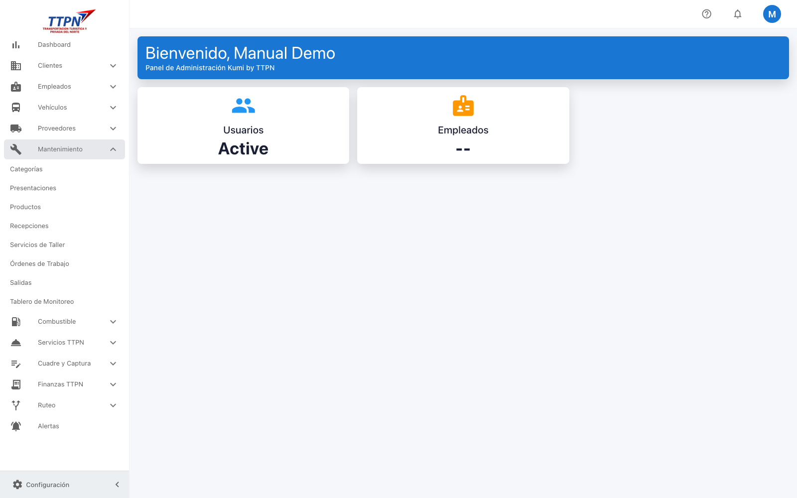

El acceso a cada sección depende de sus permisos (ver
[sección 11](#11-estados-y-permisos)).

---

## 2. Conceptos clave

Antes de capturar conviene entender 4 conceptos:

| Concepto | Qué es |
| --- | --- |
| **Unidad base** | La unidad en la que el sistema **guarda y consume** el producto (ej. *pieza* para un filtro, *litro* para un aceite). Se define en el producto. |
| **Presentación** | Cómo se **compra** el producto. Tiene dos niveles: *tamaño del envase* (ej. galón = 4.9 L) y *envases por paquete* (ej. caja x 6). El sistema multiplica los dos y obtiene cuántas unidades base entran al inventario por cada paquete recibido. |
| **Costo promedio móvil** | El costo unitario del producto se recalcula automáticamente en cada recepción, ponderando lo que ya había con lo que entra. |
| **Residuo reutilizable (costo hundido)** | En líquidos, lo que sobra de un consumo y aún sirve regresa al inventario **a costo $0**, para no ensuciar el costo promedio. |

👉 La **Presentación** es el puente entre *cómo compro* y *cómo consumo*. Por
eso es lo segundo que se captura (después de Categorías): sin ella el producto
no puede ligarse a una forma de compra.

---

## 3. Categorías

Agrupan los productos. **Mantenimiento → Categorías → Nueva Categoría**.
Capture *Nombre* y *Código* (LUBR, FILT…). Puede desactivarlas sin borrarlas.

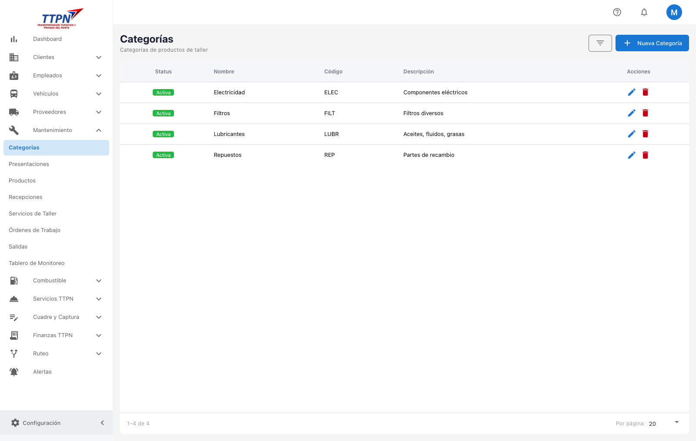

> Sugerencia: tenga al menos *Lubricantes*, *Filtros* y *Repuestos* antes de
> capturar productos.

---

## 4. Presentaciones

Define **cómo compra** cada producto. Una presentación tiene **dos niveles**:

- **Tamaño del envase (en unidad base)** — qué tan grande es **un envase**.
  Ej.: un galón de **4.9 L**; un envase de **1 L**; una **pieza** suelta (1).
- **Envases por paquete** — cuántos envases trae **el paquete que recibe**.
  Ej.: **6** para una caja con 6 galones; **24** para una caja con 24 litros;
  **1** para envases sueltos sin caja.

El sistema calcula automáticamente:

```text
Total (unid. base) = Tamaño del envase × Envases por paquete
```

### 4.1 Crear una presentación

**Nueva Presentación**, capture los 4 campos. El recuadro azul muestra el
total calculado en tiempo real (útil para verificar antes de guardar):

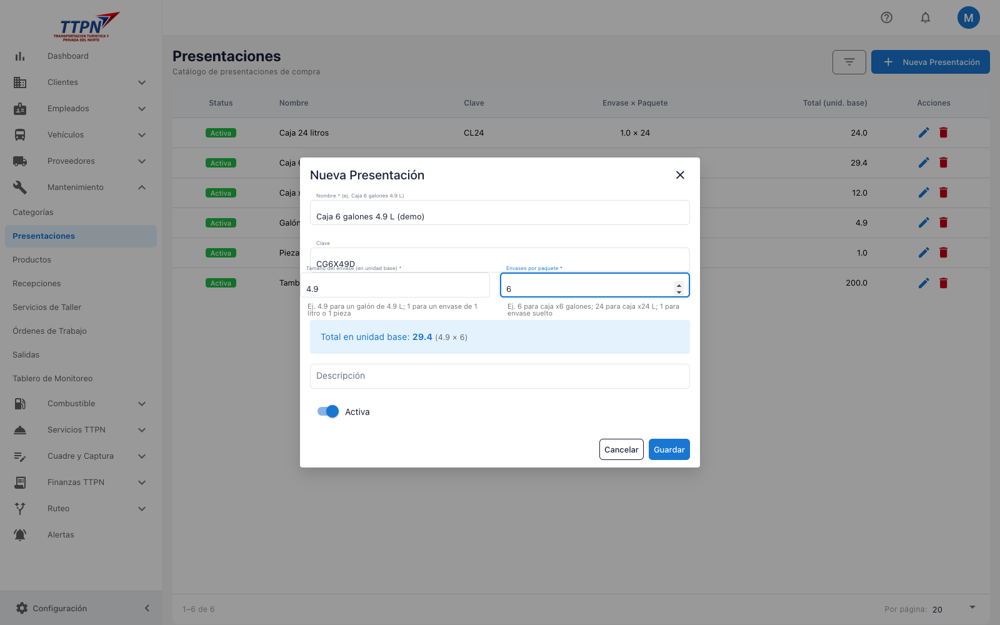

### 4.2 Catálogo de presentaciones

La lista muestra envase × paquete y el total en unidad base:

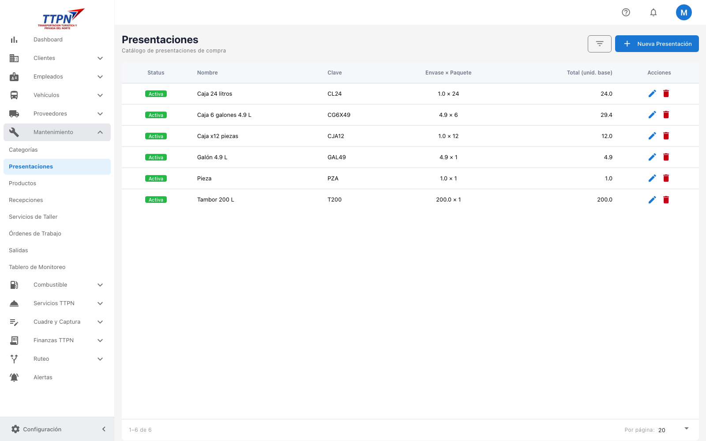

> Cree una presentación por cada **forma real** de comprar. Mismo producto
> recibido en dos formatos (caja de galones y caja de litros) ⇒ dos
> presentaciones distintas. El catálogo es libre y por unidad de negocio.

### 4.3 Ejemplos típicos

| Presentación | Envase | Paquete | Total | Para qué se usa |
| --- | --- | --- | --- | --- |
| Pieza | 1 | 1 | 1 | Refacción suelta (filtro, balata) |
| Caja x12 piezas | 1 | 12 | 12 | Filtros, focos, fusibles… |
| Galón 4.9 L | 4.9 | 1 | 4.9 | Aceite comprado por galón suelto |
| Caja 6 galones 4.9 L | 4.9 | 6 | 29.4 | Aceite comprado por caja de galones |
| Caja 24 litros | 1 | 24 | 24 | Aceite/refrigerante comprado por caja de envases de 1 L |
| Tambor 200 L | 200 | 1 | 200 | Lubricante a granel |

---

## 5. Productos

Catálogo de artículos del inventario. **Mantenimiento → Productos →
Nuevo Producto**. Los campos clave:

- **Categoría** (creada en sección 3).
- **Nombre** — el descriptivo del producto.
- **SKU** — clave formal interna o del fabricante.
- **Clave taller** — clave corta de uso rápido en taller (distinta del SKU,
  para que el mecánico la pida sin teclear el SKU completo).
- **Unidad base** — *seleccionable de una lista* (pieza, litro, mililitro,
  kilogramo, caja, …) o puede escribir una nueva. **Esta es la unidad en la que
  vivirá el inventario y se consumirá.**
- **Mín./Máx./Reorden/Lead time** — umbrales para alertas de stock.

### 5.1 Capturar un producto **por pieza** (ejemplo: Filtro de Aire)

| Campo | Valor |
| --- | --- |
| Categoría | Filtros |
| Nombre | Filtro de Aire |
| SKU | FILT-AIR-01 |
| Clave taller | FA01 |
| **Unidad base** | **pieza** |
| Mín. / Máx. / Reorden | 10 / 200 / 30 |

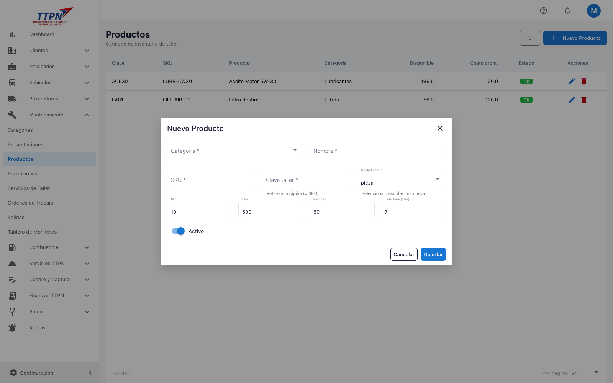

### 5.2 Capturar un producto **líquido** ⭐ (ejemplo: Aceite Motor 10W-40)

| Campo | Valor |
| --- | --- |
| Categoría | Lubricantes |
| Nombre | Aceite Motor 10W-40 |
| SKU | LUBR-10W40 |
| Clave taller | AC1040 |
| **Unidad base** | **litro** ← seleccionar del dropdown |
| Mín. / Máx. / Reorden | 20 / 600 / 100 |

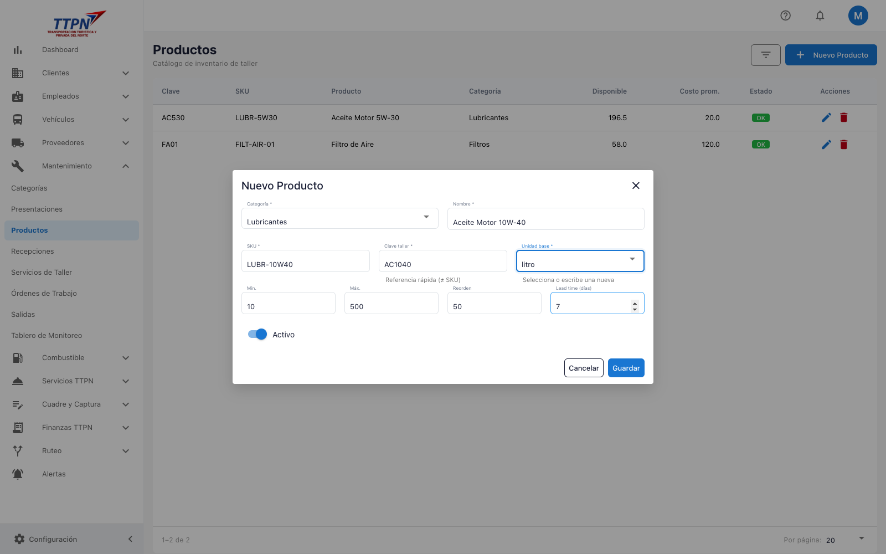

> ⚠️ La **Unidad base** se elige UNA sola vez al crear el producto y es **la
> unidad en la que el sistema cuenta el inventario y carga el consumo**. Para
> aceite use *litro* (o *mililitro* si trabaja con cantidades muy pequeñas).
> Las distintas formas de comprarlo (galón, litro suelto, caja) se manejan en
> las **Presentaciones** (sección 4), no en el producto.

### 5.3 Catálogo de productos

La lista muestra disponible, costo promedio y estado de stock
(OK / REORDER / OUT_OF_STOCK / OVERSTOCK):

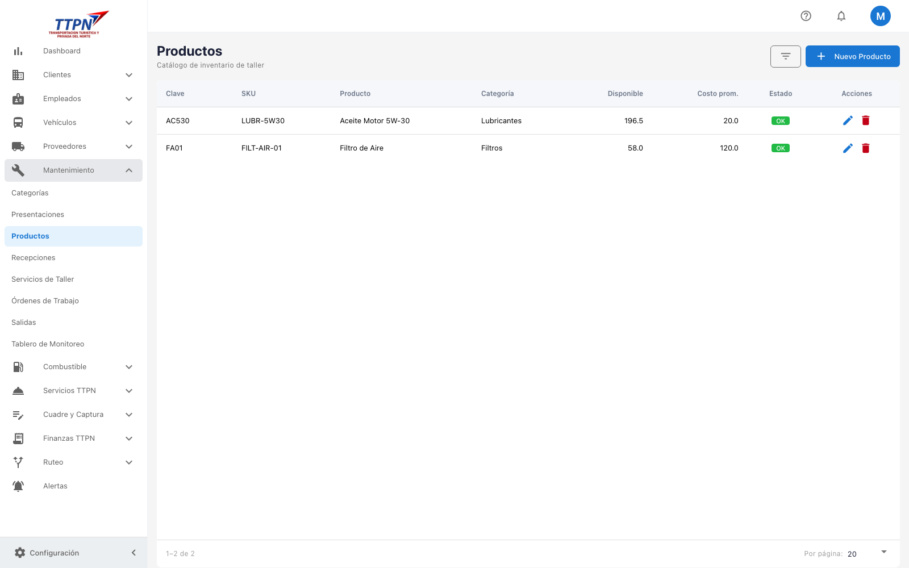

> Ejemplo real de la imagen:
> **FA01 · Filtro de Aire** (unidad base *pieza*, 58 disponibles) y
> **AC530 · Aceite Motor 5W-30** (unidad base *litro*, 196.5 disponibles).

---

## 6. Recepción de producto: pieza vs. líquido

⭐ **Esta es la sección clave.** Recibir producto siempre sigue los mismos
pasos; la diferencia entre un producto **por pieza** y uno **líquido** está
únicamente en la **Presentación** que elija, porque ella define la conversión
a unidad base.

### Pasos generales

1. **Mantenimiento → Recepciones → Nueva Recepción**.
2. Seleccione el **Proveedor** y capture:
   - **Factura del proveedor** — folio de la remisión / nota de entrega
     que entrega el proveedor con la mercancía.
   - **Factura fiscal** — folio del CFDI / factura SAT. Es opcional al
     momento de la recepción porque el proveedor a veces la emite después;
     puede dejarlo en blanco y editarlo cuando llegue.
   - **Ubicación de almacén**.
3. Por cada producto, **Agregar línea**:
   - **Producto**
   - **Presentación** ← *aquí está la diferencia pieza vs. líquido*
   - **Cant.** (en **paquetes/cajas**, no en unidad base)
   - **Costo unit.** (costo de **un paquete/caja**)
   - **Aceptado** (cuántos paquetes se aceptan tras revisión)
4. **Guardar**. La recepción queda en estado `in_progress`.
5. En la lista, use **Procesar** para que entre al inventario.

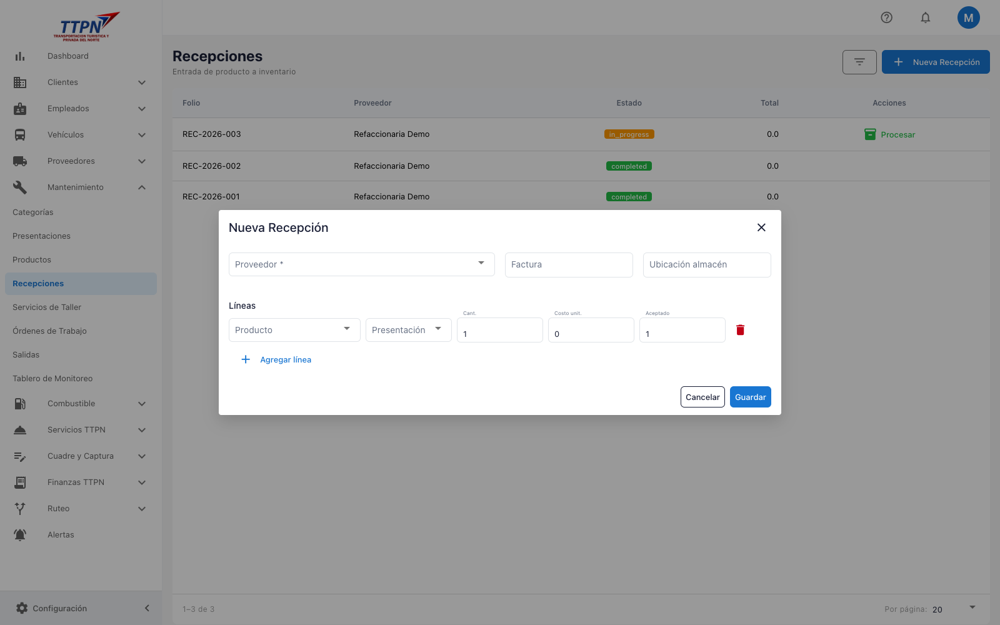

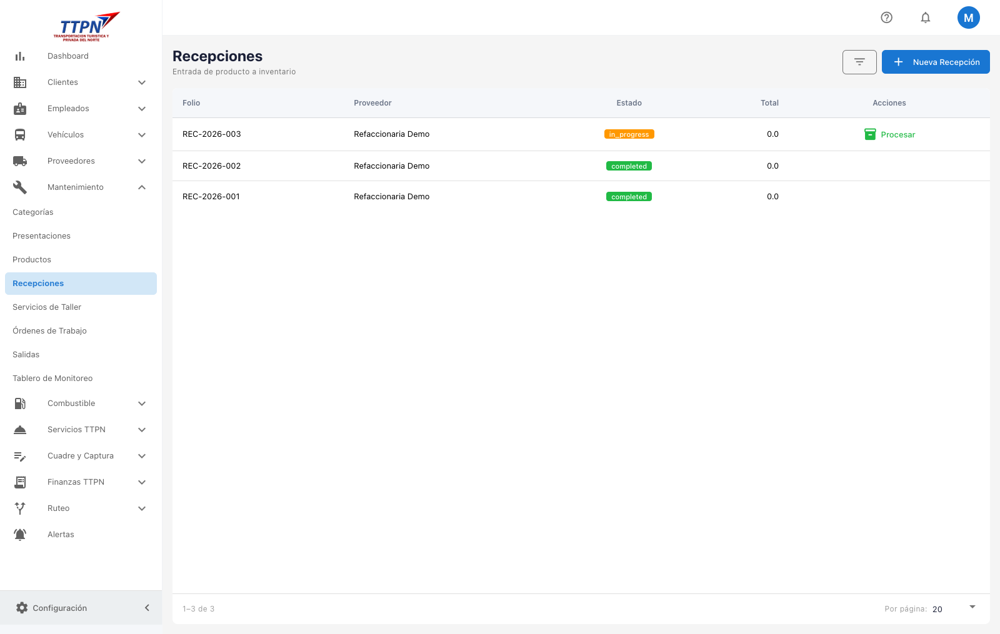

> Sólo al **Procesar** se afecta el inventario y se recalcula el costo
> promedio. Mientras está `in_progress` aún puede corregirla.
>
> La columna **Total** del listado es el **monto facturado por el proveedor**:
> Σ (Cant. × Costo unit.) de todas las líneas — es decir, **lo recibido**,
> no lo aceptado. Se actualiza solo al guardar la recepción.

### 6.1 Caso A — Producto por **PIEZA** (Filtro de Aire)

Se compran **5 cajas** de filtros, cada caja con **12 piezas**.

| Campo | Valor a capturar |
| --- | --- |
| Producto | Filtro de Aire *(unidad base = pieza)* |
| Presentación | **Caja x12 piezas** *(envase 1 × paquete 12 = 12)* |
| Cant. | **5** (cajas) |
| Costo unit. | **$1,440** (por caja) |
| Aceptado | **5** |

Al **Procesar**, el sistema convierte:

```text
5 cajas × 12 piezas = 60 piezas entran al inventario
costo por pieza     = $1,440 / 12 = $120
```

Resultado: el Filtro queda con **60 piezas** disponibles a **costo promedio
$120**. (En la captura aparece con 58, porque ya se consumieron 2 en una salida
— sección 9.)

### 6.2 Caso B — Producto **LÍQUIDO** en un solo formato (Tambor 200 L)

Se compra **1 tambor** que trae **200 litros**.

| Campo | Valor a capturar |
| --- | --- |
| Producto | Aceite Motor 5W-30 *(unidad base = litro)* |
| Presentación | **Tambor 200 L** *(envase 200 × paquete 1 = 200)* |
| Cant. | **1** (tambor) |
| Costo unit. | **$4,000** (por tambor) |
| Aceptado | **1** |

Conversión automática:

```text
1 tambor × 200 litros = 200 litros entran al inventario
costo por litro       = $4,000 / 200 = $20
```

### 6.3 Caso C — Producto **LÍQUIDO** recibido en dos formatos distintos

Cuando recibe el mismo aceite a veces en **caja de galones** y a veces en
**caja de litros**, **cada formato es una Presentación distinta** en el
catálogo (ver sección 4). La Recepción usa la presentación que corresponda en
cada línea.

**Presentaciones que deben existir (creadas una sola vez):**

| Presentación | Envase | Paquete | Total |
| --- | --- | --- | --- |
| Caja 6 galones 4.9 L | 4.9 | 6 | 29.4 L |
| Caja 24 litros | 1 | 24 | 24 L |

**Captura de cada recepción del Aceite Motor 5W-30:**

| Recepción | Presentación | Cant. | Costo unit. (caja) | El sistema suma |
| --- | --- | --- | --- | --- |
| A | Caja 6 galones 4.9 L | 1 | $1,470 | 29.4 L a $50/L |
| B | Caja 24 litros | 1 | $1,320 | 24 L a $55/L |

> Recuerde: **Cant.** es cuántas cajas recibe, **no** litros. El **Costo unit.**
> es el costo de una caja. La conversión a litros y a costo por litro la hace
> el sistema usando *Envase × Paquete* de la presentación.

**Costo promedio resultante** (móvil ponderado por unidad base):

```text
costo por litro de A = $1,470 / 29.4 = $50.00
costo por litro de B = $1,320 / 24   = $55.00

promedio combinado  = (29.4·$50 + 24·$55) / (29.4 + 24)
                    = (1,470 + 1,320) / 53.4
                    = $52.25 por litro
```

Al consumir, el costo cargado es el promedio vigente (sección 9), sin importar
de qué caja salió el aceite.

### 6.4 Regla de oro

> **Usted siempre captura en PAQUETES/CAJAS y al costo de la caja. El sistema
> convierte solo a la unidad base usando la Presentación.** Por eso es
> indispensable que la *Presentación* tenga bien capturadas el *envase* y los
> *envases por paquete* (sección 4).

---

## 7. Servicios de Taller

Catálogo de servicios con **tiempo estándar (minutos)** — estilo agencia. Lo
usa la Orden de Trabajo para estimar el tiempo total del trabajo.

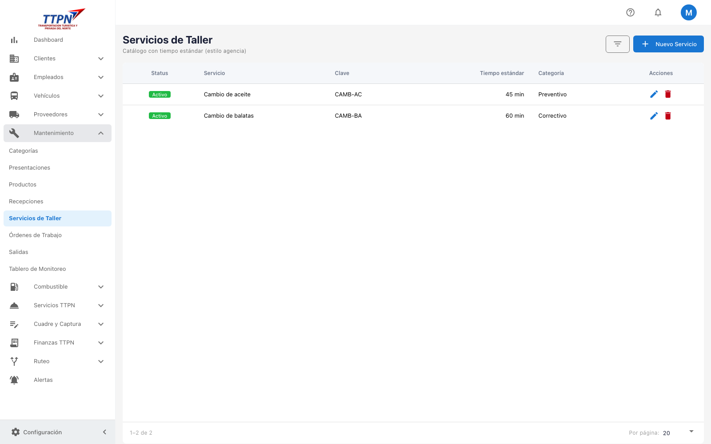

Ejemplos típicos: *Cambio de aceite* (45 min, Preventivo); *Cambio de balatas*
(60 min, Correctivo). Estos tiempos son los que se usan como referencia en el
tablero de monitoreo para detectar OT en retraso.

---

## 8. Órdenes de Trabajo

Una **Orden de Trabajo (OT)** representa un trabajo de taller sobre un
vehículo.

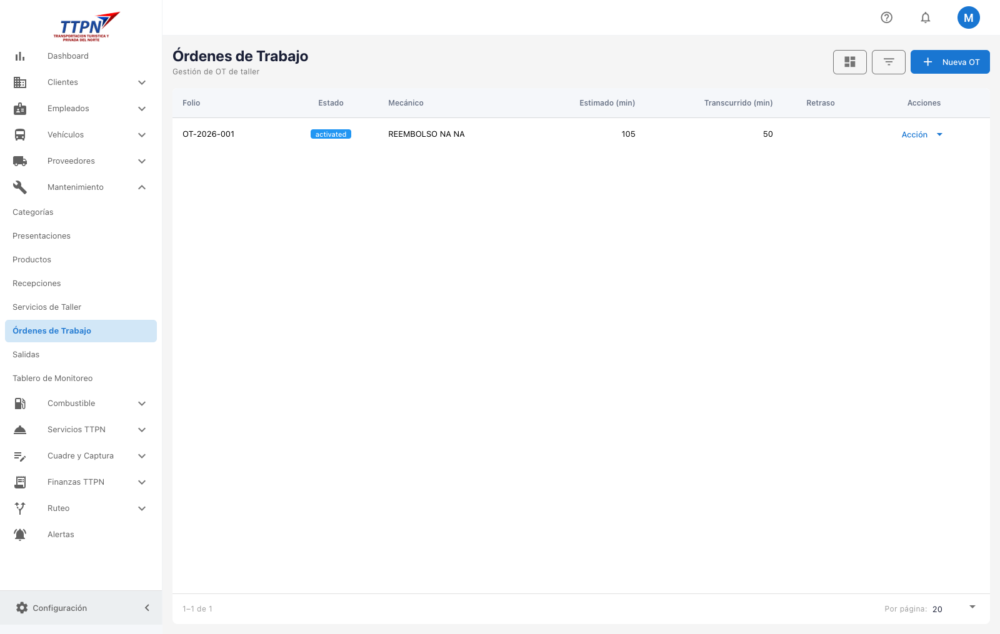

### 8.1 Crear una OT

**Nueva OT** → capture:

- **Tipo** (preventivo / correctivo / otro).
- **Mecánico** — un empleado responsable (uno por OT).
- **Vehículo** (opcional).
- **Descripción**.
- **Servicios** — uno o varios del catálogo (sección 7). El **tiempo estimado
  total** se calcula como la suma de los tiempos estándar de los servicios
  elegidos.

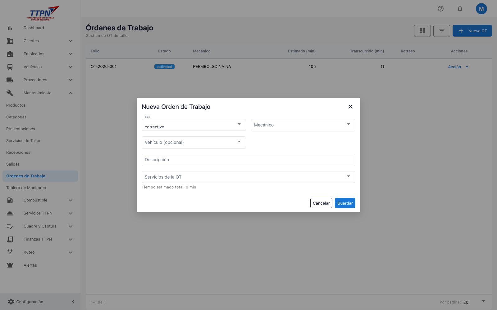

### 8.2 Ciclo de vida (Fase 1)

La OT avanza con el botón **Acción** según su estado:

```text
borrador ──activar──▶ activada ──iniciar──▶ en progreso ──completar──▶ completada
                  │                 ▲   │
                  │            reanudar  pausar
                  │                 │   ▼
                  └────cancelar──── pausada
```

- En **Fase 1 la OT la activa el administrador**.
- Al **activar** arranca el reloj; al **completar** se calcula el tiempo real.
- Si el tiempo transcurrido supera el estimado, la OT se marca **en retraso**.

El consumo de refacciones de una OT se hace con una **Salida** tipo *Orden de
Trabajo* (sección 9).

---

## 9. Salidas / consumo

Una **Salida** descuenta producto del inventario. Puede ser:

- **Departamental** — a un área (ej. “Taller Mecánico”).
- **Orden de Trabajo** — consumo asociado a una OT (sección 8).

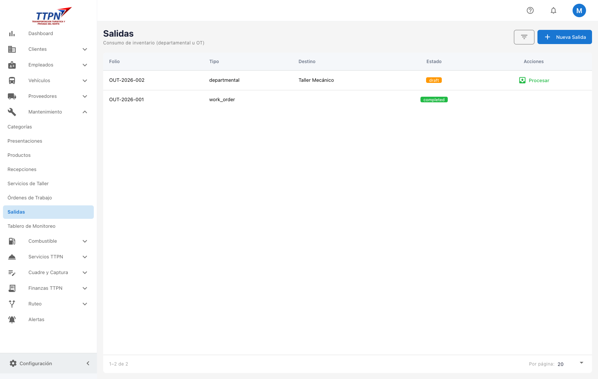

Pasos: **Nueva Salida** → elija el **Tipo** → destino u OT → agregue
**productos** con la cantidad (en unidad base) → en líquidos puede capturar
**Residuo devuelto** → **Guardar** → **Procesar**.

> **⚠️ Regla de oro de la captura.** Para líquidos, junto a cada campo
> (Cantidad y Residuo) hay un toggle **L / ml**. Captura el número como lo
> ves en el envase y elige la unidad que corresponda; el sistema convierte
> solo a la unidad base interna (litros).
>
> Ejemplo real: entregas **1 L de aceite** y te regresan **355 ml** de
> residuo. Captura `1` en Cantidad con **L** seleccionado, y `355` en
> Residuo con **ml** seleccionado. El hint debajo de Residuo te confirma
> `= 0.355 litro`.
>
> Para sólidos (filtros, repuestos) la unidad es siempre **pieza** y no
> aparece toggle.

### 9.1 Residuo reutilizable de líquidos (costo hundido)

Cuando entrega líquido a una OT y sobra una parte aún utilizable, captúrela
en **Residuo devuelto**. El sistema:

- Regresa ese residuo al inventario como “recuperado” **a costo $0**.
- **No modifica el costo promedio** (no se “ensucia”).
- En el siguiente consumo, **gasta primero el residuo recuperado** (a $0) y
  luego el stock a costo promedio.

#### 9.1.1 Cómo capturar el residuo paso a paso ⭐

**Mantenimiento → Salidas → Nueva Salida** y llene:

1. **Tipo *** = `Orden de Trabajo` (si el residuo viene de consumo de un
   trabajo). Para residuo de un proceso departamental use `Departamental`.
2. **Orden de Trabajo *** = la OT donde se generó el residuo (en el ejemplo,
   `OT-2026-001`).
3. **Motivo** = una descripción corta (ej. *“Cambio de aceite OT”*).
4. En **Productos**, en la línea del producto líquido:
   - **Producto** = el líquido (ej. `AC530 · Aceite Motor 5W-30`).
   - **Cantidad** = la cantidad **total entregada** a la OT, en unidad base
     (ej. **`5`** litros, NO 5 cajas).
   - **Residuo devuelto** = la cantidad **reutilizable** que sobra y vuelve al
     inventario (ej. **`1.5`** litros). Justo debajo de este campo se ve la
     pista `Reutilizable ($0)` — es el indicador de que esa cantidad **no
     toca el costo promedio** (entra al bucket recuperado a $0).
5. **Guardar**. La salida queda en `draft` o `in_progress`.
6. En la lista, use **Procesar** para que el sistema:
   - Descuente del inventario los **5 L** consumidos a costo promedio.
   - Cargue el **`line_cost`** = `5 × costo promedio` al expediente de la OT.
   - Reingrese los **1.5 L** como “recuperado a $0”, **sin alterar** el costo
     promedio.

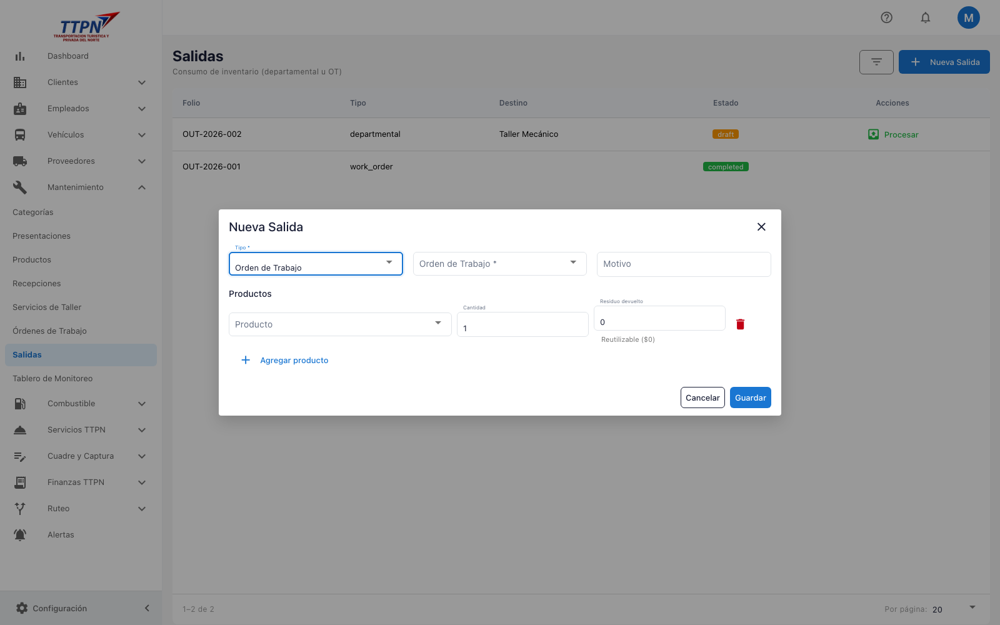

**⚠️ Cuándo NO capturar residuo.** Captura `Residuo devuelto` solo cuando el
sobrante **se va a reutilizar**. Si el sobrante se desperdició/contaminó,
déjelo en `0` — en ese caso los 5 L se consideran totalmente consumidos.

**💡 Qué pasa en la siguiente salida.** La próxima vez que se consuma del mismo
producto (otra OT u otra área), el sistema **descuenta primero del recuperado**
(a $0) antes de tocar el stock a costo promedio. Se ve como un ahorro en el
`line_cost` de esa nueva salida.

> Ejemplo real (datos demo): se entregaron **5 L** de aceite a una OT y se
> devolvieron **1.5 L** reutilizables. Inventario del aceite: 200 − 5 + 1.5 =
> **196.5 L**, con **1.5 L recuperados a $0** y el costo promedio intacto en
> **$20**.

Esto es intencional y se llama *método de costo hundido*: el costo del líquido
se reconoce completo en la primera salida; el residuo se reaprovecha sin
distorsionar costos ni generar “costos de retorno”. Detalle contable en
[`../../Backend/dominio/mantenimiento/costeo_liquidos.md`](../../Backend/dominio/mantenimiento/costeo_liquidos.md).

---

## 10. Tablero de Monitoreo

Vista en vivo de las **OT activas**, estilo agencia. Se actualiza solo (sin
recargar) cuando una OT cambia de estado o tiempo. Cada tarjeta muestra
mecánico, estimado vs. transcurrido, % de avance y alerta de retraso.

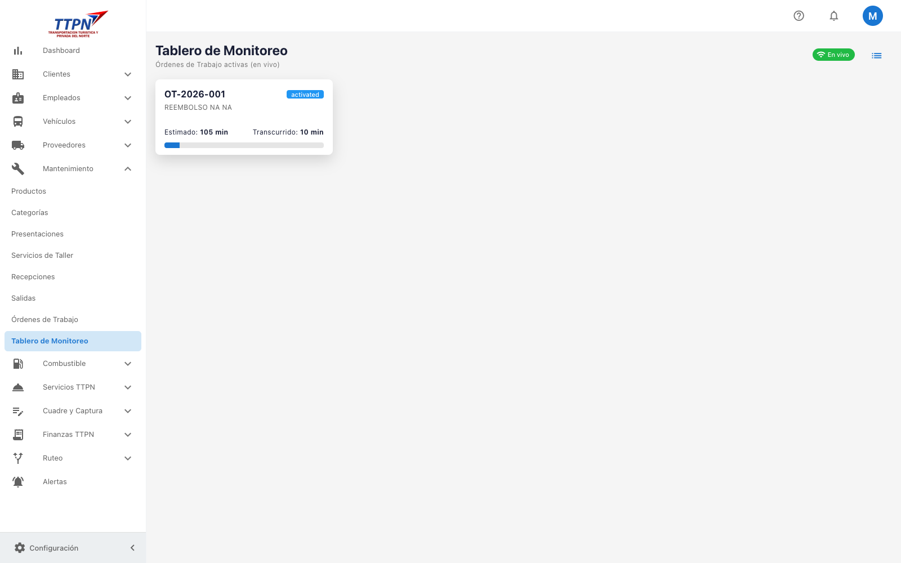

El indicador **En vivo / Desconectado** (arriba a la derecha) muestra si el
tablero está recibiendo actualizaciones en tiempo real.

---

## 11. Estados y permisos

**Recepción:** `draft` → `in_progress` → `completed` / `cancelled`.
**Salida:** `draft` → `pending_approval` → `approved` → `completed` /
`cancelled`.
**Orden de Trabajo:** `draft` → `activated` → `in_progress` → `paused` →
`completed` / `cancelled`.

Los botones de crear, editar, eliminar y **Procesar** aparecen solo si su
usuario tiene el permiso correspondiente para cada módulo de Mantenimiento. Si
no ve una sección o un botón, solicite el permiso al administrador.

---

## 12. Finanzas del Taller — Viabilidad del Proyecto

⭐ **Esta sección es para personal administrativo.** Permite registrar la
inversión inicial del taller y los gastos fijos mensuales para medir si el
proyecto va dando retorno (ROI) o si todavía está absorbiendo capital.

El módulo vive bajo **Finanzas TTPN → Viabilidad de Proyectos** y comparte
estructura con cualquier otro proyecto futuro (Servicio a Terceros,
Capacitación, etc.) — todos se reportan con la misma vista filtrando por
proyecto.

### 12.1 Concepto del módulo

Tres entidades:

1. **Proyecto** — La "bolsa" donde se acumulan los movimientos del Taller.
   Ya viene creado por defecto como **Taller Mecánico TTPN** con la marca
   "OTs taller", que significa: el sistema **suma automáticamente** como
   ingreso el `materials_cost` de cada OT cerrada (sin teclear nada).
2. **Concepto** — La plantilla del movimiento: *"Luz"*, *"Renta del local"*,
   *"Compra de compresor"*. Se da de alta una sola vez y se reusa cada mes.
3. **Movimiento** — El valor real de la factura del mes para un concepto
   (la luz de enero costó $1,480; la de febrero $1,620). Un concepto
   recurrente acumula un movimiento por mes.

### 12.2 Tipos de movimiento

| Tipo | Cuándo usar | Ejemplo |
| --- | --- | --- |
| **Inversión** | Compras one-time del arranque o expansión | Compra del compresor, juego de herramientas |
| **Gasto fijo** | Costo recurrente (mensual/trimestral/anual), aunque el monto varíe | Renta, luz, agua, internet, salarios |
| **Ingreso** | Cobros manuales (cuando arranque servicio a terceros) | Factura a flotilla externa |

> **Nota:** No captures aquí compras de aceite o refacciones — esas van en
> **Recepciones** (sección 6). El ingreso por OTs del taller se calcula
> solo, no se captura.

### 12.3 Dar de alta el proyecto del taller

El proyecto **Taller Mecánico TTPN** ya está creado. Para verlo o editarlo:
**Finanzas TTPN → Proyectos**.

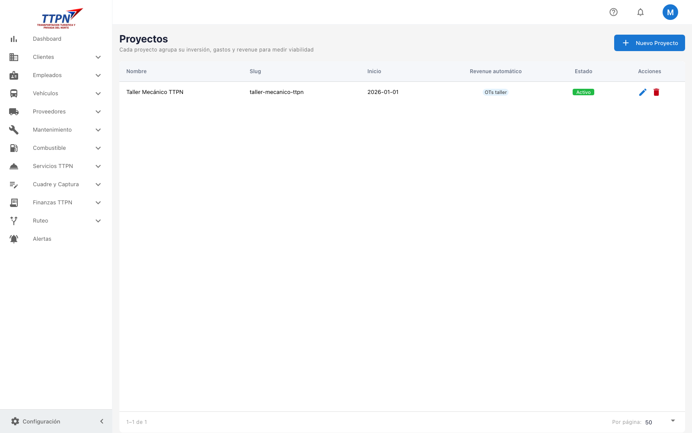

Si necesita crear un proyecto adicional (ej. *Servicio a Terceros*),
**Nuevo Proyecto** y llene:

| Campo | Qué poner |
| --- | --- |
| Nombre | Nombre descriptivo (ej. *"Servicio a Terceros"*) |
| Slug | Se autogenera del nombre; déjelo en blanco al crear |
| Descripción | Para qué es el proyecto |
| Fecha inicio | Cuándo arrancó (clave para medir ROI desde el día 1) |
| Revenue automático | **Manual** si los ingresos son externos · **OTs del taller** si quiere que sume materials_cost de OTs |
| Proyecto activo | Déjelo encendido |

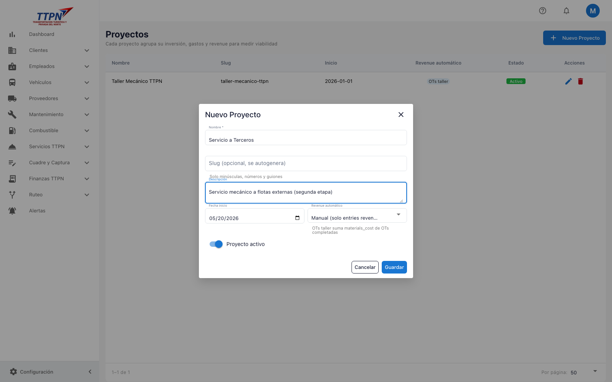

> **Sobre "Revenue automático":** solo un proyecto por unidad de negocio
> debería tener "OTs taller" — si lo asigna a varios, el `materials_cost`
> se contaría dos veces.

### 12.4 Dar de alta los conceptos del taller

**Mantenimiento → Finanzas TTPN → Viabilidad de Proyectos →** elija el
proyecto en el selector superior → tab **Conceptos**.

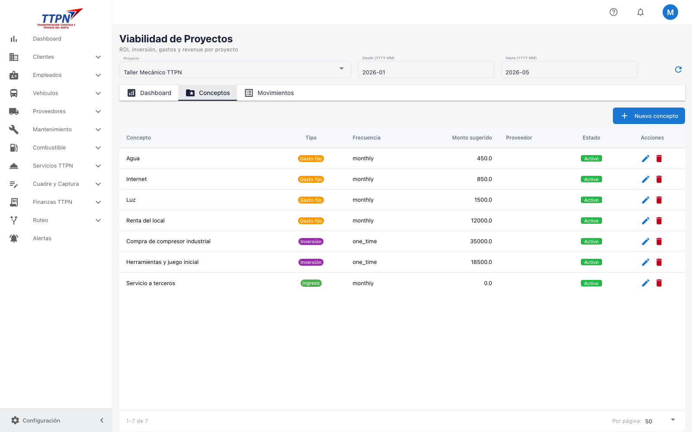

Use **Nuevo concepto** para cada concepto del taller. Lo recomendado para
arrancar:

| Concepto | Tipo | Frecuencia | Monto sugerido |
| --- | --- | --- | --- |
| Compra de compresor industrial | Inversión | Una sola vez | costo real |
| Herramientas y juego inicial | Inversión | Una sola vez | costo real |
| Renta del local | Gasto fijo | Mensual | renta mensual |
| Luz | Gasto fijo | Mensual | promedio (sirve solo de sugerencia) |
| Agua | Gasto fijo | Mensual | promedio |
| Internet | Gasto fijo | Mensual | tarifa |
| Servicio a terceros | Ingreso | Mensual | déjelo en 0 hasta que arranque |

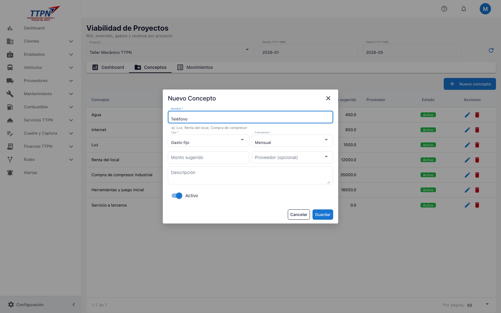

Campos importantes:

- **Tipo** y **Frecuencia** definen cómo se cataloga (no automatiza nada
  — la frecuencia es informativa).
- **Monto sugerido** prellena el campo Monto cuando captura el movimiento
  del mes; siempre puede sobrescribirlo con el monto real de la factura.
- **Proveedor** se vincula al catálogo de proveedores TTPN (útil para
  agrupar gasto por proveedor).
- **Activo**: desactive un concepto que ya no aplica (ej. *"Renta vieja"*).
  Los inactivos no aparecen en el dropdown del Movimiento.

> **Regla:** Un mismo concepto no puede tener dos movimientos del mismo
> mes (no puedes capturar *"Luz de Enero 2026"* dos veces). Si te
> equivocaste, **edita** el movimiento existente en lugar de crear otro.

### 12.5 Capturar movimientos cada mes

Tab **Movimientos** → **Nuevo movimiento**.

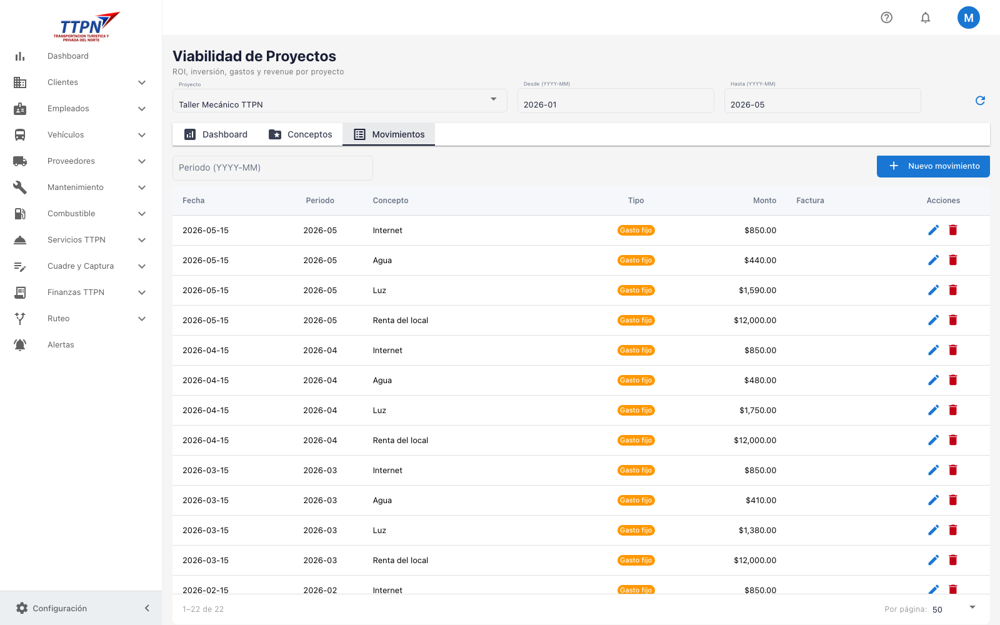

Cada vez que llega una factura (luz de junio, renta de junio, etc.):

1. **Concepto** — Seleccione el concepto al que pertenece la factura.
   El sistema prellena el Monto con el valor sugerido del concepto.
2. **Fecha** — La fecha de la factura. El periodo (YYYY-MM) se deriva
   automáticamente para agrupar movimientos.
3. **Monto** — El monto **real** que pagó este mes (no el sugerido).
4. **Factura** (opcional) — Número de folio para trazabilidad.
5. **Notas** (opcional) — Cualquier comentario contextual.

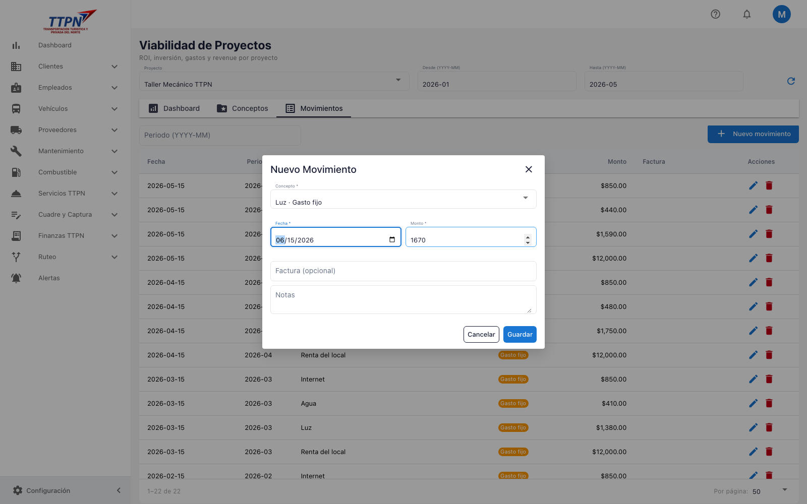

> Para **inversiones one-time**, simplemente capture un solo movimiento
> con la fecha y monto real de la compra. No necesita repetirlo cada mes.

#### Filtro por periodo

Arriba del listado de Movimientos hay un campo **Periodo (YYYY-MM)** para
filtrar solo los del mes que quiera revisar (ej. `2026-03` muestra los
movimientos de marzo).

### 12.6 Cómo leer el Dashboard

Tab **Dashboard**. Arriba elija el rango con **Desde / Hasta** (YYYY-MM).
Por defecto desde el inicio del proyecto hasta el mes actual.

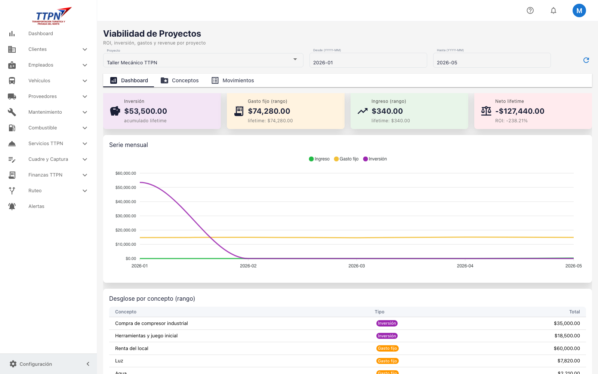

#### Las 4 tarjetas (KPIs)

| Tarjeta | Qué significa | Cómo interpretar |
| --- | --- | --- |
| **Inversión** | Suma de todos los movimientos de tipo Inversión desde siempre | Lo que "metió" al proyecto. No depende del rango — siempre es lifetime. |
| **Gasto fijo (rango)** | Σ gastos fijos del periodo seleccionado · debajo: lifetime | Cuánto le cuesta operar al taller en ese rango. El "lifetime" abajo es desde el día uno. |
| **Ingreso (rango)** | Σ ingresos manuales + automáticos de OTs en el rango · debajo: lifetime | Cuánto ha entrado. Incluye `materials_cost` de OTs si el proyecto tiene "OTs taller". |
| **Neto lifetime** | Ingreso − Inversión − Gasto fijo (todo lifetime). ROI% = neto/inversión × 100 | **Rojo = todavía pierdes capital. Verde = ya tienes utilidad real.** El ROI% te dice qué tanto. |

En el ejemplo de la captura: invertimos **$53,500**, llevamos
**$74,280** de gasto fijo y solo **$340** de ingreso (las OTs apenas
arrancaron). Neto −$127,440 · ROI −238%. Eso es **normal en taller nuevo**:
todavía está en fase de inversión y costo fijo, antes del break-even.

#### Gráfica "Serie mensual"

Muestra mes a mes:

- **Línea verde** = ingreso (manual + automático de OTs)
- **Línea amarilla** = gasto fijo
- **Línea morada** = inversión (típicamente pico en los primeros meses)

Para que el proyecto sea viable, la línea verde debe crecer hasta cruzar
y superar a la amarilla, y los picos morados deben recuperarse.

#### Desglose por concepto (rango)

Tabla al final del dashboard. Lista cada concepto que tuvo movimientos en
el rango con su total. Sirve para detectar:

- Qué gasto fijo está pesando más (¿la luz subió mucho?).
- Cuál fue el desglose de la inversión inicial.
- Qué fuentes están aportando ingreso.

#### Indicador de Break-even

Debajo de las tablas aparece uno de estos mensajes:

- 🎉 **"Break-even alcanzado en YYYY-MM"** — el ingreso acumulado superó
  inversión + gasto fijo en ese mes. A partir de ahí, todo lo que entra
  es utilidad real.
- *"Aún no se ha alcanzado el break-even del proyecto en el rango
  analizado."* — el taller sigue absorbiendo capital. Normal en los
  primeros meses.

### 12.7 Buenas prácticas

1. **Capture la factura el mismo día que llega.** Evita que se acumulen.
2. **Use el monto real, no el sugerido.** El monto sugerido es solo una
   ayuda de captura.
3. **Revise el dashboard al cierre del mes.** Es cuando se ve si los
   gastos están bajo control o si hay un servicio que se disparó.
4. **No edite movimientos viejos sin nota.** Si necesita ajustar el monto
   de la luz de febrero, agregue en "Notas" el motivo (*"corrección por
   recargos no facturados"*).
5. **Cuando arranque a facturar terceros**, cambie el concepto *"Servicio
   a terceros"* a `Ingreso` activo y capture el monto al cobrar cada
   servicio. Los ingresos automáticos de OTs internas siguen sumando aparte.

---

### Documentos relacionados

- Esquema de datos: [`../../Backend/dominio/mantenimiento/schema.sql`](../../Backend/dominio/mantenimiento/schema.sql)
- Modelo de costo de líquidos: [`../../Backend/dominio/mantenimiento/costeo_liquidos.md`](../../Backend/dominio/mantenimiento/costeo_liquidos.md)
- Endpoints API: [`../../Backend/dominio/mantenimiento/controller/endpoints.md`](../../Backend/dominio/mantenimiento/controller/endpoints.md)
- Módulo Finanzas / Viabilidad: [`../../Backend/dominio/finanzas/viabilidad/viabilidad_proyectos.md`](../../Backend/dominio/finanzas/viabilidad/viabilidad_proyectos.md)
